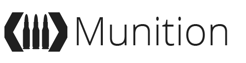

The Munition Framework is an MVC framework built in PHP.
It is designed for rapid development and deployment, easy to understand and use features, and minimal configuration.

Official Forum: http://forum.pie-studios.com/category/munition

_____________

## Getting Started

### System Requirements

 * PHP v5.4 or higher
 * Access to RewriteRules on webserver
 * Or access to php path-info
 * 

### Installing

#### Step One - Retrieve Munition(s)!

Simply fetch the latest version of the Munition Framework from GitHub.
If you want stable version, use the `latest-release` tag, otherwise just use the master branch.

#### Step Two - Load!

Either configure the neccesary configurations yourself, or let Munition help you.
Browse to where you installed Munition to with your webbrowser, and the default App should list what needs to be done before you can start developing.

#### Step Three - Fire!

You now have a small, fast and easy to use PHP framework that can be used to develop webapps, RESTful API's, backend servers, you name it.

